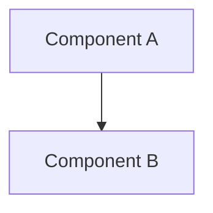
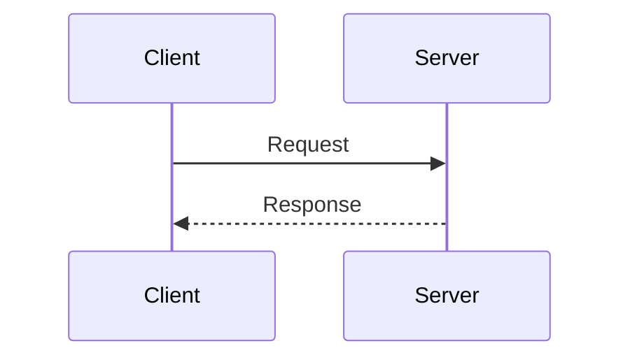
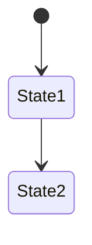
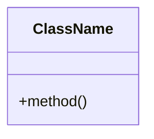
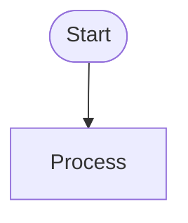

# Claude Instructions for Knights and Crosses

## Project Overview

This is the Knights and Crosses game - a multiplayer TCG (Trading Card Game) that combines 4x4 Tic-Tac-Toe with card-based gameplay. The project includes:

- Next.js + React frontend with Canvas rendering
- Express + Socket.IO backend for real-time multiplayer
- TypeScript-based AI system with genetic algorithm evolution
- Card effect system for game mechanics
- Vercel serverless deployment support with Redis

---

## Architecture Documentation Maintenance

### CRITICAL: Keep ARCHITECTURE.md Updated

**Location**: `/home/user/knights-and-crosses/ARCHITECTURE.md`

This file contains comprehensive architecture documentation with mermaid diagrams showing:
- System architecture overview
- Component relationships and class hierarchies
- Game flow and state machines
- Data models and structures
- Communication protocols
- AI system architecture
- Card system design
- Deployment strategies

### When to Update ARCHITECTURE.md

**ALWAYS** update `ARCHITECTURE.md` when you make changes in these areas:

#### 1. Structural Changes
- **New Components/Classes**: Add to class hierarchy diagrams and component descriptions
- **New Files/Directories**: Update the directory structure section
- **Removed Components**: Remove from diagrams and update descriptions
- **Component Refactoring**: Update class diagrams and component relationships

#### 2. Game Logic Changes
- **New Game Mechanics**: Update game flow diagrams and mechanics description
- **Modified Win Conditions**: Update game flow state machine
- **Turn Structure Changes**: Update turn sequence diagrams
- **Board State Changes**: Update data models section

#### 3. Card System Changes
- **New Cards**: Update card examples and card count
- **New Effect Types**: Add to EffectType enum in Card System section
- **Card Resolution Logic Changes**: Update card effect resolution flow diagram
- **Rarity Changes**: Update deck constraint documentation

#### 4. AI System Changes
- **New AI Parameters**: Update genetic parameters table
- **AI Algorithm Changes**: Update AI decision algorithm pseudocode
- **Evolution Process Changes**: Update evolution process flowchart
- **Rating System Changes**: Update rating system documentation

#### 5. Communication Protocol Changes
- **New Message Types**: Add to protocol tables (Client→Server and Server→Client)
- **Message Format Changes**: Update message format examples
- **New Socket Events**: Document in communication protocol section

#### 6. Technology Stack Changes
- **New Dependencies**: Add to technology matrix table
- **Version Updates**: Update version numbers in technology matrix
- **Library Replacements**: Update technology stack diagrams and descriptions

#### 7. Deployment Changes
- **New Deployment Targets**: Add to deployment modes diagram
- **Environment Variables**: Update environment configuration section
- **Build Script Changes**: Update build and run scripts section
- **Infrastructure Changes**: Update deployment architecture diagram

---

## How to Update ARCHITECTURE.md

### 1. Update Relevant Sections

When making code changes, identify which sections of ARCHITECTURE.md are affected:

```bash
# Example: Adding a new component
- Update "Directory Structure" section
- Update "Core Components" section
- Update "Class Hierarchy" mermaid diagram
- Update "Component Responsibilities" table
```

### 2. Update Mermaid Diagrams

The documentation uses multiple mermaid diagram types:

**Graph diagrams** - For architecture overviews:


**Sequence diagrams** - For interaction flows:


**State diagrams** - For state machines:


**Class diagrams** - For class hierarchies:


**Flowcharts** - For process flows:


### 3. Update Version and Date

Always update the footer:
```markdown
**Last Updated**: [Current Date]
**Version**: [Current Version from package.json]
```

---

## Examples of Documentation Updates

### Example 1: Adding a New Card

When adding a new card to `src/json/cards.json`:

1. **Update Card System section** - Add card to examples
2. **Update card count** - "Currently 14 cards" → "Currently 15 cards"
3. **Update Cards section in README** - If the card has new mechanics

```markdown
**New Card Name** (Rarity):
- Effect 1
- Effect 2
```

### Example 2: Adding a New Component

When creating a new React component or server class:

1. **Update Directory Structure** - Show new file location
2. **Update Class Hierarchy diagram** - Add new class and relationships
3. **Update Component Responsibilities table** - Add row with file, LOC, responsibility
4. **Update relevant sequence/flow diagrams** - Show new component in flows

### Example 3: Modifying Game Flow

When changing turn structure or game rules:

1. **Update Game Lifecycle State Machine** - Modify states/transitions
2. **Update Turn Sequence Flow** - Update sequence diagram
3. **Update Game Mechanics** - Update textual description
4. **Update examples** - Ensure examples reflect new flow

### Example 4: Technology Stack Update

When upgrading dependencies:

1. **Update package.json first** (normal workflow)
2. **Update Technology Matrix table** - New versions
3. **Update Frontend/Backend Stack diagrams** - If library changed
4. **Update deployment section** - If deployment process changed

---

## Mermaid Diagram Guidelines

### Keep Diagrams Readable

- **Limit node count**: 15-20 nodes per diagram maximum
- **Use subgraphs**: Group related components
- **Clear labels**: Use descriptive, concise labels
- **Consistent styling**: Use same style patterns across diagrams

### Diagram Update Checklist

When updating a diagram:

- [ ] All new components are included
- [ ] Removed components are deleted
- [ ] Relationships are accurate
- [ ] Labels are clear and concise
- [ ] Styling is consistent with other diagrams
- [ ] Diagram renders correctly (test with mermaid viewer)

### Common Mermaid Patterns in This Project

**Component connections:**
```mermaid
A --> B    # Direct dependency
A -.-> B   # Optional/conditional dependency
A <--> B   # Bidirectional communication
```

**Styling:**
```mermaid
style ComponentName fill:#e1f5ff    # Light blue for client
style ComponentName fill:#ffe1e1    # Light red for storage
style ComponentName fill:#ffe1ff    # Light purple for AI
```

---

## Documentation Quality Standards

### 1. Accuracy
- **Always test changes**: Ensure code changes work before documenting
- **Verify diagrams**: Check that mermaid diagrams render correctly
- **Update related sections**: Don't just update one section - update all affected

### 2. Clarity
- **Use clear language**: Avoid jargon where possible
- **Provide examples**: Show concrete examples of concepts
- **Explain "why"**: Not just "what" but "why" architectural decisions were made

### 3. Completeness
- **Don't leave gaps**: If you change component A that connects to B, update both
- **Update all diagrams**: Text, diagrams, and code examples should all align
- **Cross-reference**: Link related sections together

### 4. Consistency
- **Follow existing patterns**: Match the style and structure of existing docs
- **Use consistent terminology**: Don't call something "Game" in one place and "Match" elsewhere
- **Maintain formatting**: Keep tables, code blocks, and headers formatted consistently

---

## Common Documentation Tasks

### Adding a New Feature

1. **Plan documentation first**: Think about what diagrams need updating
2. **Update directory structure**: Show new files
3. **Update class diagrams**: Show new classes and relationships
4. **Update flow diagrams**: Show how feature fits into game flow
5. **Add examples**: Provide concrete examples of the feature
6. **Update technology stack**: If new dependencies were added

### Refactoring Code

1. **Update affected diagrams**: Change component names/relationships
2. **Update file paths**: Ensure all references point to new locations
3. **Update class hierarchies**: Reflect new structure
4. **Update responsibility tables**: Update what each component does
5. **Preserve history**: Document why refactoring was done

### Bug Fixes

Most bug fixes don't require documentation updates unless:
- The fix reveals incorrect architecture documentation
- The fix changes behavior that's documented
- The fix adds new error handling that should be documented

---

## Documentation Review Checklist

Before committing changes to ARCHITECTURE.md:

- [ ] All affected sections have been updated
- [ ] Mermaid diagrams render correctly
- [ ] Version and date in footer are updated
- [ ] No broken internal links
- [ ] Examples match current implementation
- [ ] Tables are properly formatted
- [ ] Code blocks use correct syntax highlighting
- [ ] Technology versions match package.json
- [ ] Directory structure matches actual structure
- [ ] Class diagrams reflect current code structure

---

## Working with This Project

### Key Architecture Principles

1. **Separation of Concerns**
   - Client (Canvas), Server (Express), and AI (TypeScript) are independent
   - Card system is modular and extensible
   - Storage layer abstracts Redis vs in-memory

2. **Real-time First**
   - Socket.IO for all client-server communication
   - In-memory game state for performance
   - Optional Redis for persistence

3. **AI Evolution**
   - Genetic algorithm continuously improves AI
   - Data-driven game balancing
   - Elo rating tracks AI performance

4. **Serverless Compatible**
   - Works with or without Redis
   - Stateless server functions
   - Cross-instance coordination via Redis

### Understanding the Codebase

**File Extensions**:
- `.ts` / `.tsx` - TypeScript (AI system, React components)
- `.js` - JavaScript (game logic, server)
- `.cjs` - CommonJS modules (card system)

**Key Entry Points**:
- `server.js` - Server bootstrap
- `pages/index.tsx` - Client entry
- `src/game.core.server.js` - Game logic
- `src/ai/core/GameCore.ts` - AI logic

**Data Flow**:
```
Client Canvas → Socket.IO → GameServer → GameService → Game → GameCore → CardResolver
                                                                    ↓
                                                              GameBoard
                                                              GamePlayer
```

---

## Additional Instructions

### Code Quality

When making changes to the codebase:

1. **Run tests**: `npm test` before committing
2. **Check linting**: `npm run lint` to catch issues
3. **Format code**: `npm run format` for consistent style
4. **Update tests**: Add/modify tests for changed functionality

### Git Workflow

For documentation updates:

```bash
# Make code changes
# Update ARCHITECTURE.md to reflect changes
git add ARCHITECTURE.md [other changed files]
git commit -m "feat: [description] - updated architecture docs"
```

### Communication

When working on features:

1. **Document decisions**: If making architectural decisions, document why
2. **Update diagrams proactively**: Don't wait until the end
3. **Keep it current**: Update docs as you code, not after

---

## Questions?

If you're unsure whether something needs documentation:

**Ask yourself**:
- Would a new developer need to know this to understand the system?
- Does this change how components interact?
- Does this add/remove/modify a public interface?
- Does this change game behavior or mechanics?

**If yes to any** → Update documentation

**If uncertain** → Err on the side of documenting it

---

## Summary

**The Golden Rule**: Keep ARCHITECTURE.md as current as the code itself.

When you change the code, immediately update the relevant documentation sections. Future developers (including future you) will thank you for maintaining clear, accurate, and up-to-date architecture documentation.

---

**This instruction file**: `.claude/instructions.md`
**Architecture docs**: `ARCHITECTURE.md`
**README**: `README.md`
