# Knights and Crosses - Architecture Documentation

## Table of Contents

1. [Overview](#overview)
2. [System Architecture](#system-architecture)
3. [Directory Structure](#directory-structure)
4. [Core Components](#core-components)
5. [Game Flow](#game-flow)
6. [Data Models](#data-models)
7. [Communication Protocol](#communication-protocol)
8. [AI System](#ai-system)
9. [Card System](#card-system)
10. [Technology Stack](#technology-stack)
11. [Deployment](#deployment)

---

## Overview

**Knights and Crosses** is a networked competitive multiplayer TCG (Trading Card Game) that combines a 4x4 Tic-Tac-Toe mechanic with card-based gameplay. Two players compete by playing cards that affect the board state and placing pieces to achieve four in a row.

### Key Features

- **Real-time multiplayer** using Socket.IO
- **Genetic Algorithm-based AI** for game balancing research
- **Canvas-based rendering** for game visualization
- **Serverless deployment** support with Vercel KV (Redis)
- **Automated matchmaking** for players and AI instances

### Game Mechanics

- **Players**: 2 (Host and Client)
- **Board**: 4x4 grid
- **Win Condition**: First to place 4 pieces in a row/column/diagonal
- **Deck**: 20 cards per player
- **Hand Limit**: 7 cards
- **Turn Structure**: Draw 1 card → Play 1 card (optional) → Place 1 piece

---

## System Architecture

### High-Level Architecture

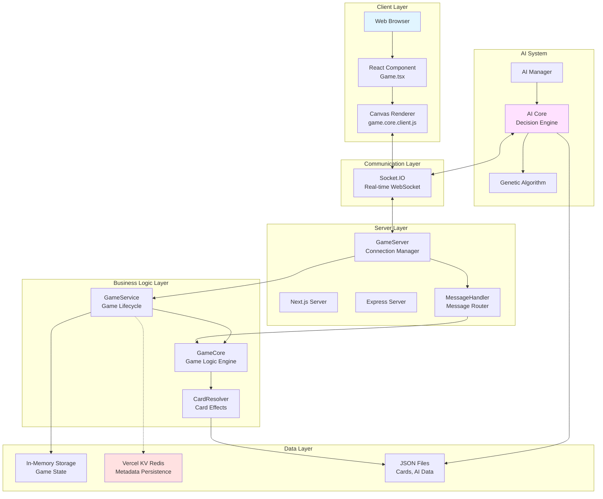

### Component Interaction Flow

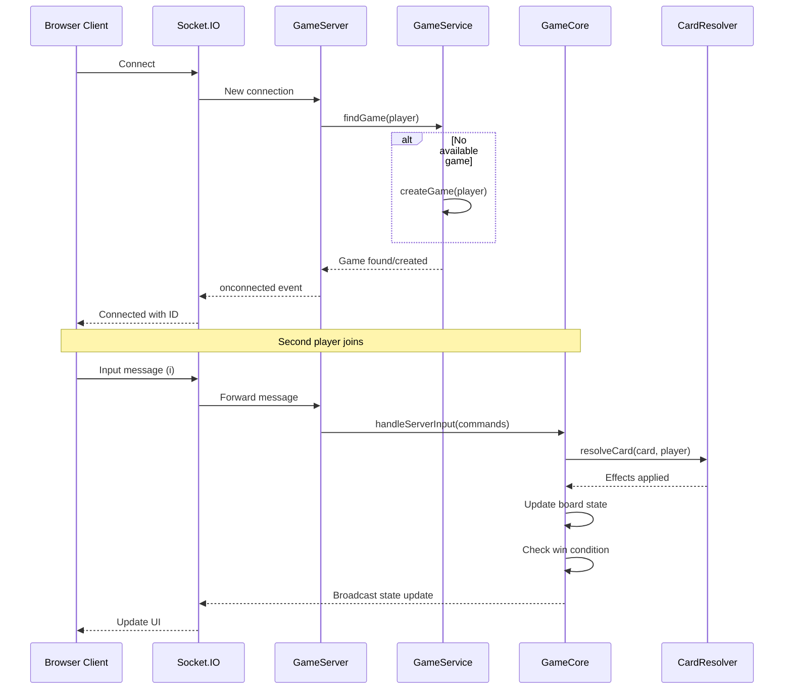

---

## Directory Structure

```
knights-and-crosses/
├── pages/                       # Next.js pages (routes)
│   ├── index.tsx               # Main game page
│   ├── _app.tsx                # React app wrapper
│   ├── _document.tsx           # HTML document wrapper
│   ├── api/
│   │   └── socket.ts           # Socket.IO API route
│   ├── ai-viewer.tsx           # AI visualization tool
│   └── deck-builder.tsx        # Deck building tool
│
├── components/                  # React components
│   └── Game.tsx                # Main game component
│
├── src/                        # Core game logic
│   ├── game.server.js          # GameServer (connection management)
│   ├── game.core.server.js     # Server-side game engine (606 lines)
│   ├── game.core.client.js     # Client-side canvas renderer
│   ├── game.core.ai.js         # AI game engine
│   ├── ai_manager.js           # AI instance manager
│   │
│   ├── ai/                     # AI system (TypeScript)
│   │   ├── core/
│   │   │   └── GameCore.ts     # AI decision engine
│   │   ├── board/
│   │   │   └── GameBoard.ts    # Board state management
│   │   ├── player/
│   │   │   └── GamePlayer.ts   # Player state
│   │   ├── config/
│   │   │   └── constants.ts    # AI parameters
│   │   └── utils/
│   │       └── helpers.ts      # Utility functions
│   │
│   ├── cards/                  # Card effect system
│   │   ├── card-resolver.cjs   # Effect application
│   │   ├── card-parser.cjs     # Effect parsing
│   │   ├── card-effects.cjs    # Effect type definitions
│   │   └── index.cjs           # Module exports
│   │
│   ├── server/                 # Server infrastructure
│   │   ├── models/
│   │   │   └── Game.js         # Game entity model
│   │   ├── services/
│   │   │   └── GameService.js  # Game lifecycle manager
│   │   ├── handlers/
│   │   │   └── MessageHandler.js # Socket message router
│   │   ├── storage/
│   │   │   └── RedisGameStorage.js # Vercel KV integration
│   │   └── utils/
│   │       └── logger.js       # Winston logger
│   │
│   └── json/                   # Data files
│       ├── cards.json          # Card definitions (14 cards)
│       ├── card_data.json      # Card balance statistics
│       ├── ai.json             # AI evolution history (150+ generations)
│       └── deck_p1.json        # Default deck
│
├── public/                     # Static assets
│   ├── assets/
│   │   ├── css/
│   │   └── sound/
│   ├── json/                   # Public JSON files (copied from src)
│   └── game.core.client.js     # Client engine (copied from src)
│
├── server.js                   # Main server bootstrap
├── package.json                # Dependencies and scripts
├── tsconfig.json               # TypeScript config
└── next.config.js              # Next.js config
```

---

## Core Components

### Class Hierarchy

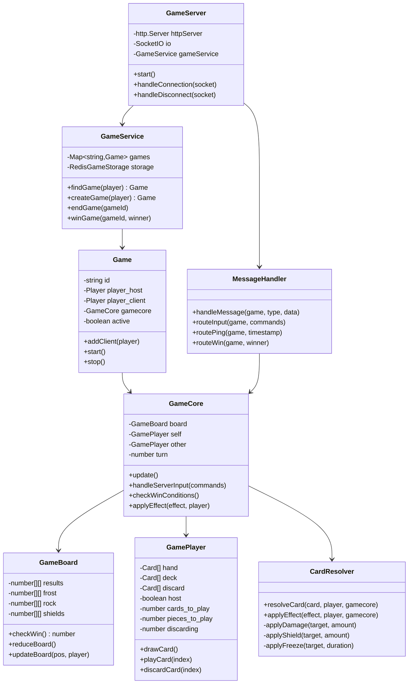

### Component Responsibilities

| Component | File | Lines | Responsibility |
|-----------|------|-------|----------------|
| **GameServer** | `src/game.server.js` | 185+ | Socket.IO connection management, player session handling |
| **GameService** | `src/server/services/GameService.js` | 140+ | Game lifecycle, matchmaking, Redis integration |
| **Game** | `src/server/models/Game.js` | 80+ | Game entity, player tracking, start/stop logic |
| **GameCore** | `src/game.core.server.js` | 606 | Game logic, turn management, win conditions |
| **MessageHandler** | `src/server/handlers/MessageHandler.js` | 60+ | Socket message routing by type |
| **CardResolver** | `src/cards/card-resolver.cjs` | 200+ | Card effect application to game state |

---

## Game Flow

### Game Lifecycle State Machine

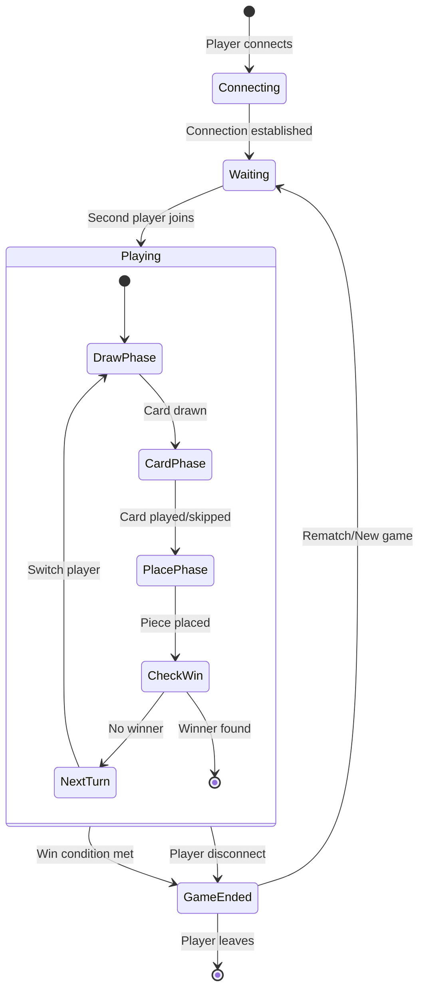

### Turn Sequence Flow

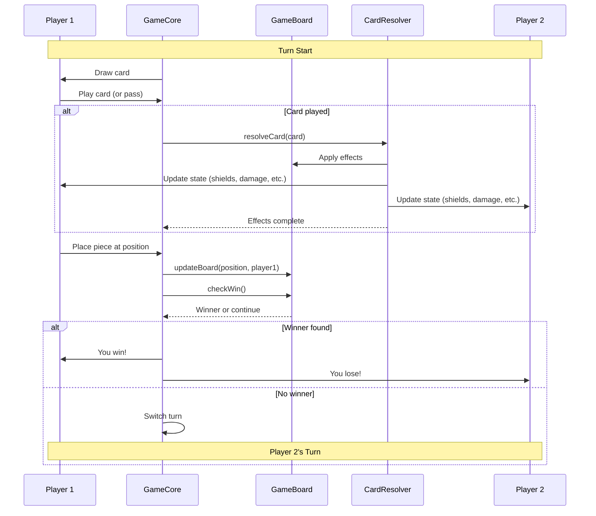

### Matchmaking Flow

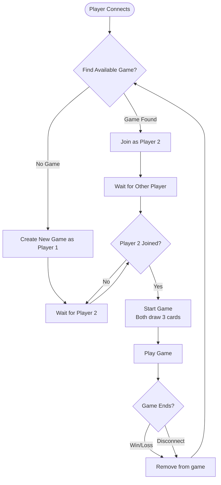

---

## Data Models

### Board State Structure

The game board consists of four separate layers, all 4x4 grids:

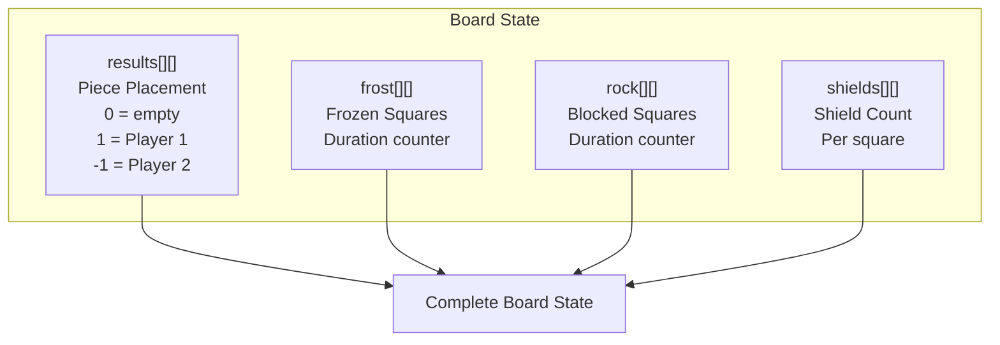

### Player State

```typescript
interface GamePlayer {
  // Core state
  host: boolean;           // Is this player the host?
  state: string;           // "connecting", "waiting", "playing"

  // Card management
  hand: Card[];           // Current hand (max 7)
  deck: Card[];           // Remaining deck
  discard: Card[];        // Discard pile

  // Action state flags (set by card effects)
  cards_to_play: number;  // Must play N more cards
  pieces_to_play: number; // Must place N more pieces
  discarding: number;     // Must discard N cards
  shielding: number;      // Must shield N pieces
  damage_to_apply: number;// Must deal N damage
  destroying: number;     // Must destroy N pieces
  drawing: number;        // Must draw N cards
  deshielding: number;    // Must remove N shields
  thawing: number;        // Must thaw N squares
  blocking: number;       // Must block N squares
  freezing: number;       // Must freeze N squares
}
```

### Card Structure

```typescript
interface Card {
  name: string;           // e.g., "Fire Blast"
  rarity: 'Basic' | 'Rare' | 'Elite';
  effects: string[];      // Effect descriptions

  // Deck constraints
  // Basic: max 3 copies
  // Rare: max 2 copies
  // Elite: max 1 copy, max 5 elite cards per deck
}
```

### Game Entity Model

```typescript
interface Game {
  id: string;                    // Unique game ID
  player_host: Player;           // First player
  player_client: Player | null;  // Second player (null if waiting)
  player_count: number;          // 1 or 2
  active: boolean;               // Is game running?
  gamecore: GameCore;            // Game logic engine
}
```

---

## Communication Protocol

### Socket.IO Message Format

Messages use a period-delimited format:

```
TYPE.DATA1.DATA2.DATA3
```

### Client → Server Messages

| Type | Format | Description |
|------|--------|-------------|
| `i` | `i.COMMANDS.TIME.SEQUENCE` | Input (card play, piece placement) |
| `p` | `p.TIMESTAMP` | Ping for latency measurement |
| `r` | `r.LATENCY` | Latency report |
| `m` | `m.MMR` | MMR (rating) report |
| `w` | `w` | Win notification |

### Server → Client Messages

| Type | Format | Description |
|------|--------|-------------|
| `s.h` | `s.h.TIME` | Hosted (you are player 1) |
| `s.j` | `s.j.HOST_ID` | Joined (player 2 joined) |
| `s.r` | `s.r.TIME` | Ready (game starting) |
| `s.n` | `s.n.PLAYER_NAME` | Name change |
| `s.e` | `s.e` | End game |
| `s.p` | `s.p.TIMESTAMP` | Pong (ping response) |
| `onconnected` | `{id, name}` | Connection acknowledgment |

### Input Command Format

The input message (`i`) contains comma-separated commands:

```
CARD_INDEX-PIECE_POSITION,CARD_INDEX-PIECE_POSITION,...
```

Example: `i.3-7,5-12.1234567.001`
- Play card at index 3, place piece at position 7
- Play card at index 5, place piece at position 12
- Timestamp: 1234567
- Sequence: 001

---

## AI System

### AI Architecture

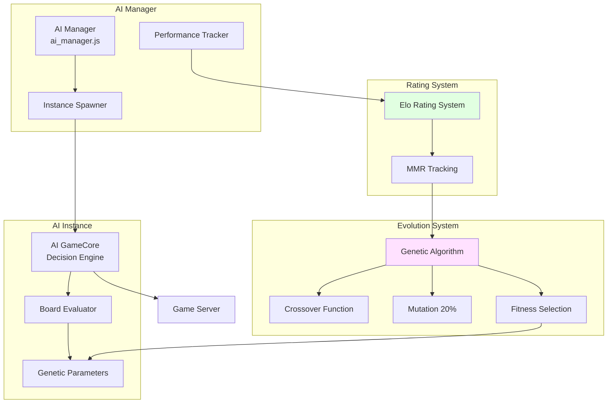

### AI Decision Algorithm

The AI evaluates board states using a parameterized scoring function:

```typescript
function evaluateBoard(board: GameBoard, params: AIParams): number {
  let score = 0;

  // Evaluate all rows, columns, and diagonals
  for (const line of getAllLines(board)) {
    const playerPieces = countPieces(line, AI_PLAYER);
    const enemyPieces = countPieces(line, ENEMY_PLAYER);
    const shields = countShields(line);
    const frozen = countFrozen(line);
    const blocked = countBlocked(line);

    // Apply genetic parameters
    score += playerPieces * params.playerCardValue;
    score -= enemyPieces * params.enemyCardValue;
    score += shields * params.shieldMod;
    score += frozen * params.freezeMod;
    score += blocked * params.rockMod;

    // Center position bonus
    if (isCenterPosition(line)) {
      score += params.centerMod;
    }

    // Enemy proximity modifier
    if (hasEnemyAdjacent(line)) {
      score *= params.enemyMod;
    }
  }

  return score;
}
```

### Genetic Parameters

The AI uses 7 evolved parameters for decision-making:

| Parameter | Range | Purpose |
|-----------|-------|---------|
| `playerCardValue` | 0-97 | Weight of own pieces |
| `enemyCardValue` | 0-70 | Weight of opponent pieces |
| `centerMod` | 0.6-2.7 | Center square preference |
| `enemyMod` | 1.4-2.2 | Opponent position weight |
| `shieldMod` | 0.6-1.8 | Shield priority |
| `freezeMod` | 0.6 | Freeze effect priority |
| `rockMod` | 0.8 | Block priority |

### Evolution Process

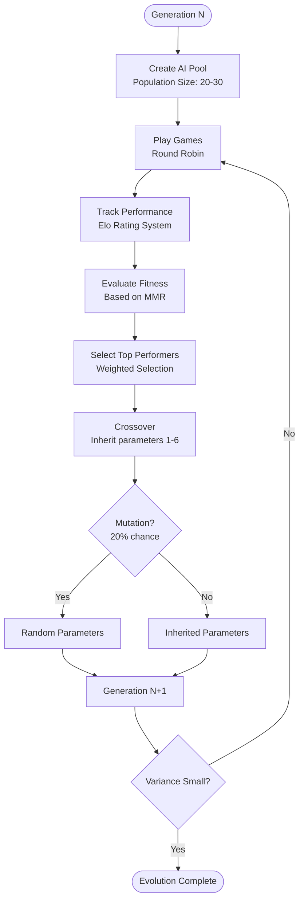

---

## Card System

### Card Effect Resolution Flow

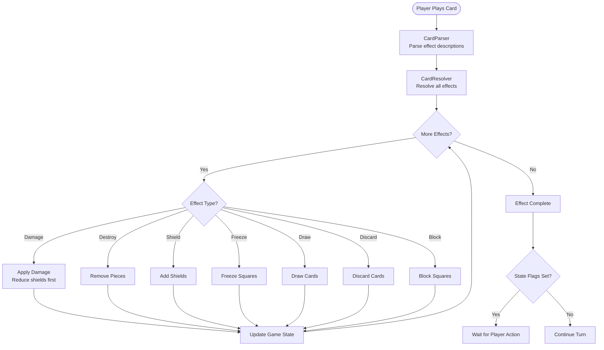

### Effect Types

```typescript
enum EffectType {
  DAMAGE = 'damage',              // Deal damage to pieces
  DESTROY = 'destroy',            // Remove pieces outright
  SHIELD = 'shield',              // Protect pieces
  DESHIELD = 'deshield',          // Remove shields
  FREEZE = 'freeze',              // Block square usage
  THAW = 'thaw',                  // Unfreeze squares
  BLOCK = 'block',                // Place blocking rock
  DRAW = 'draw',                  // Draw cards
  DISCARD = 'discard',            // Discard cards
  RETURN_TO_HAND = 'return',      // Return card to hand
  END_TURN = 'end_turn'           // End turn immediately
}

enum TargetType {
  SELF = 'self',                  // Own pieces
  OPPONENT = 'opponent',          // Enemy pieces
  SQUARE = 'square',              // Specific square
  ALL = 'all',                    // All pieces
  CONDITIONAL = 'conditional'     // Conditional targeting
}
```

### Card Examples

**Fire Blast** (Basic)
```json
{
  "name": "Fire Blast",
  "rarity": "Basic",
  "effects": ["Deal 1 damage"]
}
```

**Floods** (Rare)
```json
{
  "name": "Floods",
  "rarity": "Rare",
  "effects": ["Destroy all pieces", "End your turn"]
}
```

**Armour Up** (Basic)
```json
{
  "name": "Armour Up",
  "rarity": "Basic",
  "effects": ["Shield a piece", "Draw a card"]
}
```

---

## Technology Stack

### Frontend Stack

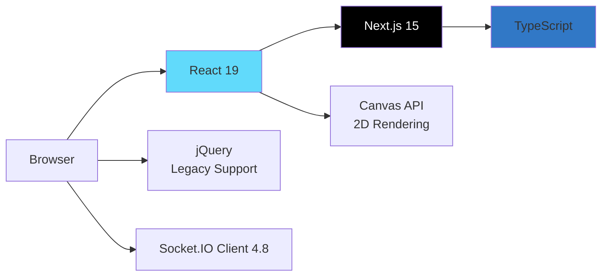

### Backend Stack

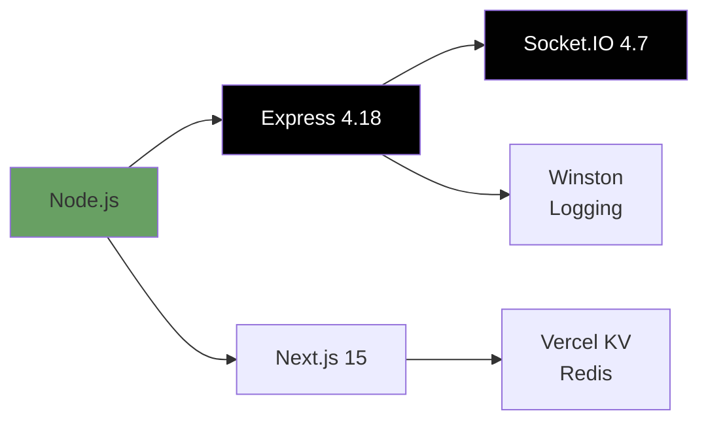

### Technology Matrix

| Category | Technology | Version | Purpose |
|----------|-----------|---------|---------|
| **Framework** | Next.js | 15.5.6 | Full-stack React framework, SSR |
| **Frontend** | React | 19.2.0 | UI component library |
| **Language** | TypeScript | 5.3.3 | Type-safe JavaScript |
| **Backend** | Express | 4.18.2 | HTTP server, routing |
| **Real-time** | Socket.IO | 4.7.4 | WebSocket communication |
| **Database** | Vercel KV | 3.0.0 | Redis for serverless |
| **Rendering** | Canvas API | Native | Game visualization |
| **Logging** | Winston | 3.11.0 | Structured logging |
| **Testing** | Jest | 29.7.0 | Unit testing |
| **Linting** | ESLint | 8.56.0 | Code quality |
| **Formatting** | Prettier | 3.6.2 | Code formatting |

---

## Deployment

### Deployment Modes

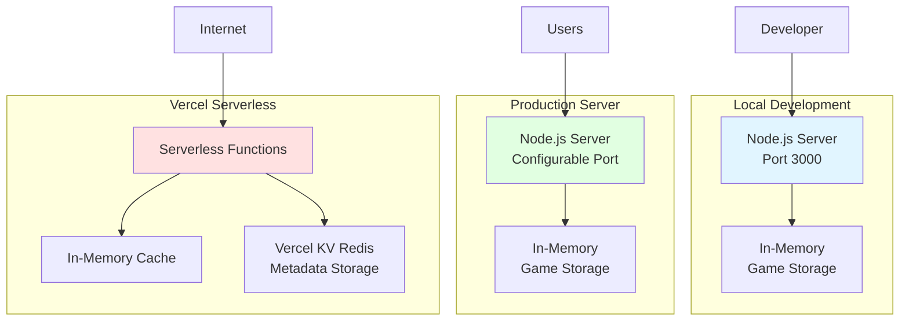

### Build and Run Scripts

```bash
# Development
npm run dev           # Copy assets + start dev server

# Production Build
npm run build         # Copy assets + build Next.js

# Production Run
npm start             # Start production server

# AI Training
npm run create-ai     # Spawn AI instances for training

# Testing
npm test              # Run Jest tests

# Code Quality
npm run lint          # Run ESLint
npm run format        # Run Prettier
```

### Environment Configuration

```bash
# Optional: Vercel KV (Redis) for serverless deployment
KV_REST_API_URL=https://your-kv.vercel.com
KV_REST_API_TOKEN=your-token
KV_URL=redis://...

# Server Configuration
PORT=3000                    # Server port (default: 3000)
NODE_ENV=production          # Environment mode
```

### Redis Integration

The game uses a hybrid storage approach:

1. **In-Memory (Fast)**: All game state is kept in memory for performance
2. **Redis (Persistence)**: Game metadata is persisted to Redis for:
   - Cross-instance game discovery (serverless environments)
   - Recovery from instance restarts
   - Automatic cleanup with 1-hour TTL

```typescript
// Storage strategy
class GameService {
  private games: Map<string, Game> = new Map(); // In-memory
  private storage?: RedisGameStorage;           // Optional Redis

  async createGame(player: Player): Promise<Game> {
    const game = new Game(player);

    // Always store in memory (fast)
    this.games.set(game.id, game);

    // Optionally persist metadata to Redis (serverless)
    if (this.storage) {
      await this.storage.saveGame({
        id: game.id,
        player_host: player.id,
        player_count: 1
      });
    }

    return game;
  }
}
```

---

## Key Implementation Files

### Critical Files Reference

| File | LOC | Description | Key Classes/Functions |
|------|-----|-------------|----------------------|
| `src/game.core.server.js` | 606 | Server game engine | GameCore, GameBoard, GamePlayer |
| `src/game.server.js` | 185+ | Connection manager | GameServer |
| `src/server/services/GameService.js` | 140+ | Game lifecycle | GameService.findGame(), createGame() |
| `src/game.core.client.js` | 500+ | Client renderer | Canvas rendering, input handling |
| `src/cards/card-resolver.cjs` | 200+ | Card effects | resolveCard(), applyEffect() |
| `src/ai/core/GameCore.ts` | 300+ | AI decision engine | evaluateBoard(), getMoves() |
| `components/Game.tsx` | 150+ | React component | Game component, library loading |

---

## Future Architecture Considerations

### Potential Improvements

1. **State Management**
   - Consider Redux/Zustand for client state management
   - Migrate from Canvas to React components for better maintainability

2. **Performance**
   - Implement delta compression for network messages
   - Add client-side prediction for reduced latency

3. **Scalability**
   - Implement Redis pub/sub for multi-server coordination
   - Add game session migration for server restarts

4. **Code Organization**
   - Migrate all JavaScript to TypeScript
   - Separate client/server code into distinct packages
   - Create shared types package for client/server

5. **Testing**
   - Add integration tests for game flow
   - Implement E2E tests with Playwright
   - Add AI unit tests with known scenarios

---

## Glossary

| Term | Definition |
|------|------------|
| **TCG** | Trading Card Game - a card-based strategy game |
| **Elo Rating** | Chess rating system adapted for AI performance tracking |
| **MMR** | Matchmaking Rating - player/AI skill level |
| **Genetic Algorithm** | Evolutionary optimization technique for AI parameters |
| **Serverless** | Cloud execution model where server management is abstracted |
| **Socket.IO** | Real-time bidirectional event-based communication library |
| **SSR** | Server-Side Rendering - rendering React on the server |

---

## Documentation Maintenance

This documentation should be updated when:

- New features are added to the game
- Architecture changes are made (new components, refactoring)
- Technology stack is updated (version bumps, new libraries)
- Game mechanics are modified (rules, cards, win conditions)
- Deployment strategy changes

See `.claude/instructions.md` for guidelines on keeping this documentation current.

---

**Last Updated**: 2025-10-22
**Version**: 1.2.0
**Maintained By**: Development Team
